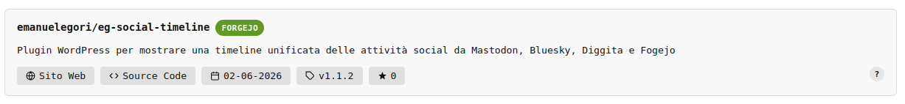

# EG Ranking Repo

WordPress plugin that displays a compact card with repository data from GitHub or Forgejo via shortcode.



## Features

- Responsive card, as wide as the post column
- Unified action row: **Website · Source Code · Date · Version · Stars · ?**
- Version badge read from the latest release; falls back to the latest git tag if no releases exist
- Localised tooltips on every element (Italian / English based on the WordPress language)
- `?` badge linking to the plugin repository
- Transient cache with configurable duration (default 6 hours)
- Anti-SSRF protection via `wp_safe_remote_get()`
- Customisable colours from the admin settings page
- Internationalised (it_IT included)

## Requirements

- WordPress 6.0 or higher
- PHP 8.0 or higher
- EG Forgejo Updater (for automatic updates)

## Installation

1. Upload the `eg-ranking-repo` folder to `wp-content/plugins/`
2. Activate the plugin from the WordPress Plugins page
3. Configure the options under **Settings > EG Ranking Repo**

## Usage

Insert the shortcode in any page, post, or widget that supports shortcodes:

```
[eg-ranking-repo url="https://github.com/owner/repo"]
[eg-ranking-repo url="https://git.emanuelegori.uno/owner/repo"]
```

Works with GitHub and any self-hosted Forgejo or Gitea instance.

## Card Data

| Field              | Source                                        |
|--------------------|-----------------------------------------------|
| Repository name    | `full_name` API field                         |
| Description        | `description` API field                       |
| Website            | `homepage` / `website` of the repo            |
| Source Code        | URL passed in the shortcode                   |
| Last updated       | `updated_at`                                  |
| Version            | Latest release tag; falls back to git tag     |
| Stars              | `stargazers_count` / `stars_count`            |

If no website is set in the repository, the button is shown as disabled.

## Configuration

Go to **Settings > EG Ranking Repo**:

- **GitHub Personal Access Token**: without a token the limit is 60 requests/hour. With a personal token it rises to 5,000/hour and enables access to private repositories.
- **Forgejo API Token**: required only for private repositories or instances with mandatory authentication.
- **Cache duration**: data is cached via WordPress transients. Default: 6 hours.
- **Colours**: customise card background, card text, button background and button text.
- **Remove token**: delete a compromised token without accessing the database.

## Updates

The plugin integrates with **EG Forgejo Updater** via the hook:

```php
do_action('eg_forgejo_updater_register', __FILE__, 'eg-ranking-repo');
```

To release a new version:

1. Update `EGR_VERSION` in `eg-ranking-repo.php` and the `Version:` field in the header
2. Commit and push to the Forgejo repository

EG Forgejo Updater detects the new version by reading the `Version:` field directly from the source file on the `main` branch — no releases or tags required.

## File Structure

```
eg-ranking-repo/
├── eg-ranking-repo.php          WP header, constants, bootstrap
├── uninstall.php                Options and transient cleanup on uninstall
├── screenshot-1.png             Card screenshot
├── includes/
│   ├── class-egr-main.php       Init, EG Forgejo Updater hook
│   ├── class-egr-api.php        GitHub/Forgejo API calls, cache, formatting
│   ├── class-egr-shortcode.php  Shortcode and card HTML rendering
│   └── class-egr-settings.php  wp-admin settings page
├── assets/
│   └── css/
│       └── eg-ranking-repo.css  Frontend card styles
└── languages/
    ├── eg-ranking-repo.pot      Translation template
    └── eg-ranking-repo-it_IT.po Italian translation
```

## Licence

GPL-2.0-or-later — https://www.gnu.org/licenses/gpl-2.0.html
